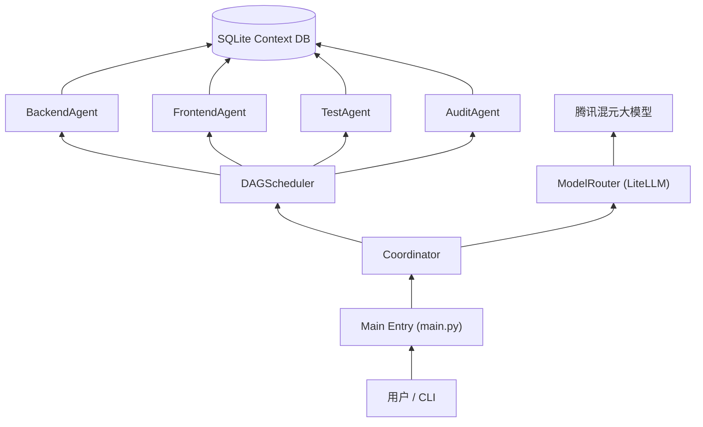
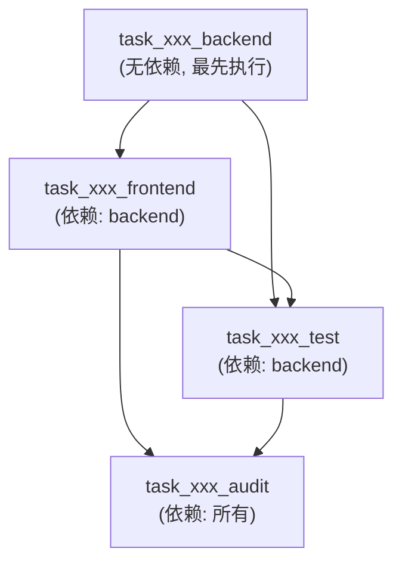
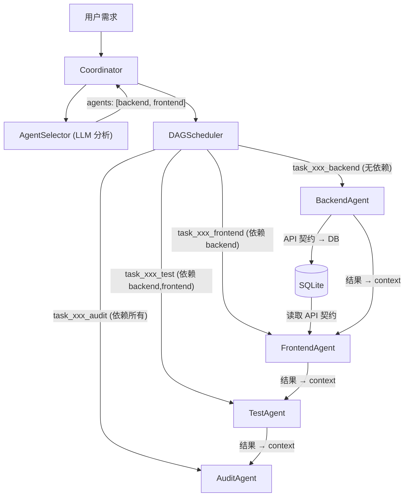
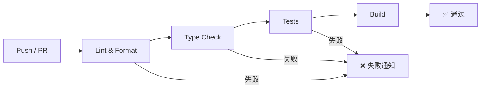

# Full-Stack Coding Assistant Agent

企业级全栈代码助手智能体 - 多智能体协作架构

## 🐍 Python 版本要求

- **最低版本**: Python 3.11
- **推荐版本**: Python 3.13+ (性能最优)
- **已测试版本**: 3.11, 3.12, 3.13

### 检查 Python 版本

```bash
python --version
# 或
python3 --version
```

### 创建虚拟环境 (Python 3.13+)

```bash
# 使用 venv (推荐)
python -m venv venv
source venv/bin/activate

# 或使用 conda
conda create -n coding-agent python=3.13
conda activate coding-agent
```

---

## 架构概述

本项目实现了一个基于多智能体架构的企业级全栈代码助手，包含以下核心组件：

- **Coordinator** - 轻量级协调器，负责任务拆解和调度
- **Frontend Agent** - 前端专家智能体
- **Backend Agent** - 后端专家智能体
- **Test Agent** - 测试专家智能体
- **Audit Agent** - 代码审计智能体

## 技术栈

- **LiteLLM** - 统一大模型接口，支持多模型切换和 Fallback
- **SQLite** - 零部署嵌入式数据库 (Python 3.13+ 内置支持)
- **CodeBuddy CLI** - 代码执行和沙箱环境

## 项目结构

```
multi_agent_coding_assistant/
├── coordinator/          # 协调器和调度器
│   ├── coordinator.py   # 主协调器
│   └── dag.py          # DAG 任务调度器
├── agents/              # 智能体模块
│   ├── base_agent.py    # Agent 基类
│   ├── frontend_agent.py
│   ├── backend_agent.py
│   ├── test_agent.py
│   └── audit_agent.py
├── model/               # 模型路由
│   ├── model_router.py  # LiteLLM 封装
│   └── config.py        # 模型配置
├── storage/             # 数据存储
│   ├── context_db.py    # SQLite 操作封装
│   └── schema.sql       # 数据库表结构
├── executor/            # 代码执行器
│   └── cb_integration.py # CodeBuddy CLI 集成
├── config.yaml          # 应用配置
├── main.py             # 入口文件
├── run.sh              # 运行脚本
├── requirements.txt    # 依赖清单 (Python 3.13+)
├── pyproject.toml     # 项目元数据
├── .python-version     # Python 版本指定
├── .env.example        # 环境变量模板
└── .gitignore         # Git 忽略规则
```

## 🚀 快速开始

### 1. 克隆项目

```bash
git clone git@github.com:Kingsdom005/full-stack-coding-assistant-agent.git
cd full-stack-coding-assistant-agent
git checkout develop  # 切换到开发分支
```

### 2. 创建虚拟环境 (Python 3.13+)

```bash
# 方法 1: 使用 venv
python -m venv venv
source venv/bin/activate  # Linux/Mac
# 或
venv\Scripts\activate     # Windows

# 方法 2: 使用 conda
conda create -n coding-agent python=3.13
conda activate coding-agent
```

### 3. 安装依赖

```bash
pip install -r requirements.txt
# 或
pip install -e ".[dev]"  # 包含开发依赖
```

### 4. 配置环境变量

```bash
cp .env.example .env
vim .env  # 编辑 .env，填写 TENCENT_API_KEY
```

**.env 文件最少配置：**

```bash
TENCENT_API_KEY=sk-your_actual_key_here
TENCENT_API_BASE=https://api.hunyuan.cloud.tencent.com/hyllm/v1
```

### 5. 运行项目

```bash
# 方法 1: 直接运行
python main.py "开发一个用户登录功能" "包含前后端实现"

# 方法 2: 使用运行脚本
chmod +x run.sh
./run.sh "开发一个用户登录功能" "包含前后端实现"
```

---

## 🔧 配置说明

### 模型配置 (`model/config.py`)

```python
MODEL_CONFIG = {
    "default": "hunyuan-lite",
    "agents": {
        "frontend": "hunyuan-lite",      # 前端 Agent 使用轻量模型
        "backend":  "hunyuan-standard",   # 后端 Agent 使用标准模型
        "test":     "hunyuan-lite",       # 测试 Agent 使用轻量模型
        "audit":    "hunyuan-pro",        # 审计 Agent 使用专业模型
    },
    "tencent": {
        "api_base": "https://api.hunyuan.cloud.tencent.com/hyllm/v1",
        "api_key": os.getenv("TENCENT_API_KEY"),
    },
    "fallback_chain": ["hunyuan-lite", "hunyuan-standard"],
}
```

### 获取 API Key

1. 访问 [腾讯云控制台](https://console.cloud.tencent.com/)
2. 进入 "混元大模型" 产品页
3. 创建应用并获取 API Key

---

## 📊 运行示例

```bash
# 示例 1: 开发登录功能
python main.py "开发一个用户登录功能" "包含前后端实现，支持 JWT 认证"

# 示例 2: 开发 RESTful API
python main.py "开发一个博客 API" "支持 CRUD 操作，使用 FastAPI"

# 示例 3: 修复 Bug
python main.py "修复用户注册 Bug" "邮箱验证不生效"
```

**输出示例：**

```
============================================================
全栈代码助手智能体 (Full-Stack Coding Assistant Agent)
============================================================

[1/3] 初始化协调器...
[2/3] 提交任务: 开发一个用户登录功能
  主任务 ID: task_a1b2c3d4

[3/3] 开始执行任务...
------------------------------------------------------------
[backend] 执行中...
[frontend] 执行中...
[test] 执行中...
[audit] 执行中...
------------------------------------------------------------

执行结果:
============================================================

[task_a1b2c3d4_backend]:
  状态: completed

[task_a1b2c3d4_frontend]:
  状态: completed

[task_a1b2c3d4_test]:
  状态: completed

[task_a1b2c3d4_audit]:
  状态: completed

任务状态汇总:
============================================================
  backend: completed
  frontend: completed
  test: completed
  audit: completed

完成！
```

---

## 🏗️ 架构设计

### 分层混合架构

```
┌─────────────────────────────────────────┐
│           User / API Layer              │
└──────────────────┬──────────────────────┘
                   │
┌─────────────────────────────────────────┐
│         Coordinator (Lite)              │
│   - 任务拆解  - DAG 调度  - 上下文管理  │
└──────────────────┬──────────────────────┘
                   │
        ┌──────────┼──────────┐
        │          │          │
┌───────▼───┐ ┌───▼──────┐ ┌▼──────────┐
│ Frontend  │ │ Backend  │ │   Test    │
│  Agent    │ │  Agent   │ │   Agent   │
└───────────┘ └──────────┘ └───────────┘
                                    │
┌───────────────────────────────────▼─────┐
│            Audit Agent                   │
│     (异步审计，不阻塞主流程)              │
└─────────────────────────────────────────┘

        共享上下文 (SQLite)
```

### 模型路由策略

- 默认使用腾讯混元免费模型 (`hunyuan-lite`)
- 各 Agent 可配置不同模型
- 支持 Fallback 链式降级

### 数据存储设计

使用 SQLite 零部署方案 (Python 3.13+ 内置支持)，设计四张核心表：

- `tasks` - 任务记录
- `code_changes` - 代码变更记录
- `api_contracts` - 前后端接口契约
- `audit_reports` - 审计意见

---

#### Mermaid 架构图（GitHub 可自动渲染）



#### DAG 任务依赖关系图



---

## 🔬 技术细节深挖

> 本章节深入剖析项目的设计原理和实现细节，帮助开发者和架构师理解系统全貌。

---

### 1. System Prompt 与 Rules 设计

#### 1.1 System Prompt 设计原则

所有 Agent 的 System Prompt 通过各子类的 `get_system_prompt()` 方法硬编码实现，遵循以下设计原则：

| 设计原则 | 说明 |
|---------|------|
| **明确角色定义** | 每个 Agent 都有清晰的专家角色定位（如"资深后端开发专家"） |
| **职责边界清晰** | 明确列出该 Agent 负责的职责（3-5 条） |
| **输出格式强制约束** | 使用 `### FILE:` 标记 + 代码块格式，确保输出可被机器解析 |
| **工程化约束** | 要求生成可直接运行的完整项目（含配置文件） |

#### 1.2 各 Agent 的 System Prompt 要点

- **FrontendAgent**：角色"资深前端开发专家"（React/Vue/Angular）；输出格式 `### FILE: frontend/App.tsx` + 代码块；工程约束：必须生成 `package.json` / `tsconfig.json` / `public/index.html`
- **BackendAgent**：角色"资深后端开发专家"（Python/Java/Node.js）；输出格式 `### FILE: backend/main.py` + 代码块；特殊设计：要求在代码注释中嵌入 API 契约（供 FrontendAgent 消费）
- **TestAgent**：角色"资深测试开发专家"（Jest + RTL / pytest）；输出格式 `### FILE: tests/test_api.py` + 代码块；工程约束：必须生成 `jest.config.js` / `setupTests.ts`
- **AuditAgent**：角色"资深代码安全审计专家"（OWASP Top 10）；输出格式 **JSON**（每行一个 JSON 对象，含 `severity`/`category`/`message`/`suggestion`）

#### 1.3 API 契约嵌入机制（前后端协同的关键）

`BackendAgent` 的 System Prompt 要求在代码注释中嵌入结构化 API 契约：

```python
### API_CONTRACT_START
endpoint: /api/login
method: POST
request_schema: {"username": "string", "password": "string"}
response_schema: {"token": "string", "user": {"id": "int", "name": "string"}}
### API_CONTRACT_END
```

`BackendAgent._extract_api_contracts()` 方法解析这些注释，存入 `api_contracts` 表。
`FrontendAgent.execute()` 从数据库读取契约，注入到自己的 prompt 中，实现前后端契约驱动开发。

#### 1.4 Rules 的实现方式

项目中没有独立的 `rules/` 配置文件，规则通过三层机制实现：

| 层级 | 实现方式 | 示例 |
|------|---------|------|
| **隐式规则** | System Prompt 中的指令 | "代码必须可直接运行" |
| **显式规则** | 代码中的硬编码逻辑 | `_parse_llm_code_output()` 强制解析 `### FILE:` 格式 |
| **配置规则** | `config.yaml` + `model/config.py` | `fallback_chain: ["hunyuan-lite", "hunyuan-standard"]` |

---

### 2. 上下文工程（Context Engineering）

#### 2.1 上下文存储设计

使用 SQLite 作为零部署的上下文数据库，设计四张核心表：

```sql
tasks         -- 任务记录（task_id, description, status, result, error）
code_changes  -- 代码变更记录（task_id, agent_type, file_path, change_type, diff）
api_contracts -- API 契约（task_id, endpoint, method, request_schema, response_schema）
audit_reports -- 审计意见（task_id, severity, category, message, suggestion, file_path）
```

索引策略：在 `task_id` 字段上建立索引，加速上下文查询。

#### 2.2 上下文传递机制

```
用户需求
  │
  ▼
Coordinator.submit_task()
  │  创建 main_task_id
  │  为每个 Agent 创建子任务：{main_task_id}_{agent_type}
  │  将共享 context（description, requirements）注入每个任务
  ▼
DAGScheduler.add_task(task_id, agent_type, dependencies, context)
  │  将任务加入 DAG，建立依赖边
  ▼
DAGScheduler.get_runnable_tasks()
  │  返回所有依赖已完成的任务（入度为 0）
  ▼
Coordinator.run() → agent.execute(task_id, context)
  │  context = DAGScheduler.get_task_context(task_id)
  │     ↓ 合并依赖任务的结果到 context:
  │     context[f"{dep_agent_type}_result"] = dep_result
  ▼
下游 Agent 的 execute() 方法从 context 中读取上游结果
```

#### 2.3 迭代模式上下文收集

`BaseAgent._collect_existing_code()` 方法：

1. 扫描 `output_dir/{agent_type}/` 目录下所有已有文件
2. 格式化为 `### FILE: {rel_path}\n{content}\n` 格式
3. 注入到 LLM 的 user_prompt 中，实现"基于已有代码迭代修改"

#### 2.4 Agent 执行 Trace 保存

每次 Agent 执行后，完整的 LLM 输入输出会被保存到 `output_dir/traces/{agent_type}/{timestamp}_{task_id}.md`：

```markdown
# Agent Trace: backend

## Token 用量
| Step | 模型 | Prompt Tokens | ... |

## 系统提示词 (System Prompt)
...

## 用户提示词 (User Prompt)
...

## LLM 原始输出 (Raw Response)
...

## 解析结果 (Parsed Result)
- 生成/修改的文件: backend/main.py, backend/models.py
- 提取的 API 契约: POST /api/login, GET /api/users
```

---

### 3. 规约驱动开发（Spec-Driven Development）

#### 3.1 设计理念

项目支持从结构化需求文档（PDF/TXT/MD）中提取需求，驱动代码生成。

#### 3.2 实现方式

| 组件 | 文件路径 | 功能 |
|------|---------|------|
| `utils/pdf_reader.py` | PDF/TXT/MD 读取器 | 提取文本、清洗格式、分块处理大文档 |
| `main.py --pdf` | CLI 参数 | 从 PDF 文件加载项目需求 |
| 交互模式 `load` 命令 | 交互式加载 | 在对话中动态加载规约文档 |
| `dataset/` | 测试数据集 | 存放示例规约文档，用于测试和演示 |

#### 3.3 使用流程

```bash
# 方式 1：命令行直接指定 PDF
python main.py --pdf docs/需求规格说明书.pdf "开发一个订单管理系统"

# 方式 2：交互模式中加载
python main.py
>>> load docs/需求规格说明书.pdf
>>> 请基于以上文档开发后端 API

# 方式 3：继续已有项目 + 加载新需求 PDF
python main.py --continue output/20260530_230000_xxx --pdf new_spec.pdf
```

---

### 4. Skills 与 MCP

#### 4.1 Skills（技能机制）

当前项目**未使用独立的 Skills 机制**。各 Agent 的"技能"通过其 System Prompt 中的角色定义和职责描述来体现。

未来可扩展方向：将 Agent 能力拆分为可插拔的 Skill 模块，通过配置文件动态组合。

#### 4.2 MCP（Model Context Protocol）

当前项目**未集成 MCP**。模型调用通过 **LiteLLM** 统一接口实现，支持：

- 多模型切换（按 Agent 类型配置不同模型）
- Fallback 链式降级（主模型失败时自动切换）
- Token 用量追踪（每次调用记录 prompt/completion/total tokens）
- 流式输出支持（`stream_chat()` 方法）

---

### 5. CodeBuddy Agent SDK 集成

#### 5.1 架构

```
Coordinator / Agent
       │
       ▼
CodeBuddyExecutor（静态方法类）
       │
       ▼  subprocess.run()
CodeBuddy CLI
       │
       ▼
沙箱环境（代码执行 / 测试运行 / 代码审查）
```

#### 5.2 封装的 CLI 命令

| 方法 | CLI 命令 | 功能 |
|------|---------|------|
| `apply_code_edit()` | `codebuddy apply-edit` | 应用代码修改（将 LLM 生成的代码写入文件） |
| `run_code()` | `codebuddy run-code` | 在沙箱中运行代码（支持 python/javascript/typescript） |
| `run_tests()` | `codebuddy run-tests` | 运行测试套件 |
| `review_code()` | `codebuddy review` | AI 代码审查（输出 JSON 格式审查意见） |
| `get_suggestions()` | `codebuddy suggest` | 获取代码补全建议 |

#### 5.3 配置与错误处理

- CLI 路径和超时时间通过 `model/config.py` 中的 `CODEBUDDY_CONFIG` 配置
- 超时控制：默认 60 秒，可通过参数覆盖
- 错误处理：捕获 `subprocess.TimeoutExpired`（超时）和 `FileNotFoundError`（CLI 未安装）

---

### 6. 多 Agent 协同机制

#### 6.1 协同架构



#### 6.2 任务依赖与调度

| 任务 | 依赖 | 说明 |
|------|------|------|
| `task_xxx_backend` | 无 | 最先执行，生成 API 和契约 |
| `task_xxx_frontend` | `backend` | 读取后端契约，生成前端代码 |
| `task_xxx_test` | `backend`, `frontend` | 读取前后端代码，生成测试 |
| `task_xxx_audit` | `backend`, `frontend`, `test` | 审计所有代码 |

DAG 调度器使用**拓扑排序**确定执行顺序，支持并行执行无依赖关系的任务。

#### 6.3 失败级联机制

当某个 Agent 执行失败时：

1. `DAGScheduler.mark_failed(task_id)` 被调用
2. `_cascade_failure(task_id)` 通过 **BFS 遍历**所有下游任务
3. 所有下游任务被标记为 `failed`（避免死锁）
4. 错误信息记录到数据库，包含级联取消的原因

#### 6.4 智能 Agent 选择

`AgentSelector` 使用轻量模型（frontend 配置的模型）分析用户需求：

1. 构建包含用户需求和可选 Agent 列表的 prompt
2. LLM 输出 JSON：`{"agents": ["backend", "frontend"], "reason": "..."}`
3. `_fix_dependencies()` 自动修正依赖（如选中 frontend 但未选中 backend，则自动添加）

#### 6.5 Token 用量汇总

每次执行完成后，`Coordinator._collect_usage_summary()` 收集所有 Agent 的 token 用量：

- 每个 Agent 的 `_usage_log` 记录每次 LLM 调用的详细信息
- 汇总报告保存到 `output_dir/usage_summary.md`
- 控制台打印格式化的汇总表格

---

### 7. CI/CD 流程详解

#### 7.1 流水线全景



#### 7.2 各阶段详解

| 阶段 | 工具 | 检查内容 | 失败处理 |
|------|------|---------|---------|
| **Lint & Format** | `black --check` | 代码格式是否符合 PEP 8 | 终止流水线 |
| | `isort --check-only` | import 语句排序 | 终止流水线 |
| | `flake8` | 语法错误、未使用变量、复杂度 | 终止流水线 |
| **Type Check** | `mypy` | 类型注解一致性检查 | 终止流水线 |
| **Tests** | `pytest` + `coverage` | 单元测试覆盖率（目标 >80%） | 终止流水线 |
| **Build** | `python -m build` | 构建 wheel 包并验证导入 | 终止流水线 |

#### 7.3 测试矩阵

```yaml
strategy:
  matrix:
    python-version: ["3.11", "3.12", "3.13"]
```

确保在三个 Python 版本下测试全部通过。

#### 7.4 Mock API Key 策略

CI 环境中的测试不依赖真实 LLM API 调用：

```yaml
- name: Run tests
  env:
    TENCENT_API_KEY: ci-mock-key
    TENCENT_API_BASE: https://mock-api.example.com/v1
  run: |
    pytest tests/ -v --tb=short \
      --ignore=agents --ignore=executor \
      --ignore=output --ignore=dataset
```

测试聚焦于纯逻辑模块（DAG 调度、输出管理、配置验证、模块导入）。

#### 7.5 覆盖率报告

- 终端输出：`--cov-report=term`
- XML 报告：`--cov-report=xml`（用于 Codecov 上传）
- HTML 报告：`--cov-report=html`（本地查看）

---

## 🧪 测试

```bash
# 运行单元测试
pytest tests/

# 运行测试并生成覆盖率报告
pytest --cov=agents --cov=coordinator --cov=model --cov=storage --cov-report=html
```

---

## 🔄 CI/CD

本项目使用 GitHub Actions 进行持续集成，工作流配置位于 `.github/workflows/ci.yml`。

### CI 流水线阶段

| 阶段 | 说明 | 触发条件 |
|------|------|----------|
| **Lint & Format** | black + isort + flake8 代码风格检查 | push / PR 到 main/master/develop |
| **Type Check** | mypy 静态类型检查 | push / PR 到 main/master/develop |
| **Tests** | pytest 单元测试 (Python 3.11/3.12/3.13) | push / PR 到 main/master/develop |
| **Build** | 构建验证 | 前三个阶段通过后 |

### 本地运行 CI 检查

```bash
# 格式检查
black --check .
isort --check-only .
flake8 . --max-line-length=120

# 类型检查
pip install -e ".[dev]"
mypy .

# 运行测试
TENCENT_API_KEY=sk-mock-key pytest tests/ -v
```

> 注：CI 中的测试聚焦于纯逻辑模块（DAG 调度、输出管理、配置验证、模块导入），不依赖真实 LLM API 调用。

---

## 📁 分支策略

本项目采用 **Git Flow** 分支策略：

- `main` - 生产分支，稳定版本
- `develop` - 开发集成分支
- `feature/*` - 功能分支
- `bugfix/*` - Bug 修复分支
- `hotfix/*` - 紧急修复分支

### 开发流程

```bash
# 1. 切换到 develop 分支
git checkout develop

# 2. 创建功能分支
git checkout -b feature/new-feature

# 3. 开发并提交
git add -A
git commit -m "feat: 新功能描述"

# 4. 推送到远程
git push origin feature/new-feature

# 5. 创建 Pull Request 合并到 develop
```

---

## 🤝 贡献指南

1. Fork 本项目
2. 创建功能分支 (`git checkout -b feature/AmazingFeature`)
3. 提交更改 (`git commit -m 'Add some AmazingFeature'`)
4. 推送到分支 (`git push origin feature/AmazingFeature`)
5. 创建 Pull Request

---

## 📄 License

MIT License

---

## 📧 联系方式

- 作者: Your Name
- 邮箱: your.email@example.com
- GitHub: [@Kingsdom005](https://github.com/Kingsdom005)
